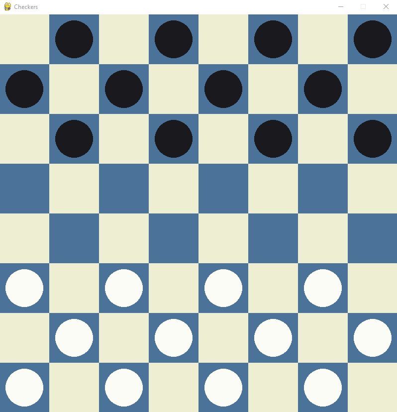
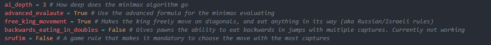

# Checkers

Coded in Python using pygame, a checkers game against an AI using minimax with alpha beta pruning.



<h3>Includes customizable rules and settings:</h3>



<h3>Info on the evaluating system:</h3>

the evaluation system for the minimax algorithm is able to give the board a score based on a number of factors. Positive score is better for the AI player, negative score is better for the human player. The evaluating system has two modes that can be switched in the settings file:

Simple eval: Gives the board a score purely on the number of pieces and kings. Exact formula: <br>
```black_left - white_left + (black_kings * 0.5 - white_kings * 0.5)```

Advanced eval: Gives the board a 5 digit score, based on multiple factors:
<li>11###: Score based on the amount of AI pieces on board minus the amount of human pieces. Normal pieces are given a value of 3, kings a value of 5. </li>
<li>##11#: Score based on the amount of the location of the AI pieces. The closer they are to the edges, the higher the score. </li>
<li>####1: A random value, to make the AI pick randomly between moves that lead to the same outcome. Makes the game more interesting and less repetitve. </li>
